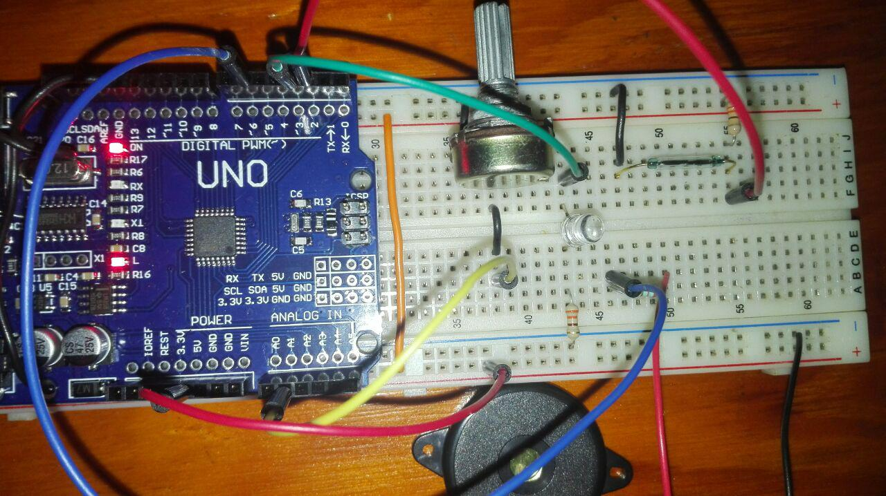
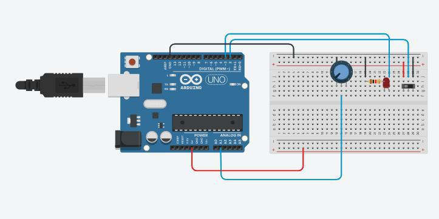

Sistema notificador de llegada de individuos
====================================

Descripción del proyecto
------------------------

Desarrollar una alarma con arduino para el acceso a una puerta.
Cuando la puerta se abra, la alarma debería sonar.
Tomando como requisito indispensable:Reducir el consumo de energía
al mínimo. Mientras la alarma no esté sonando el arduino deberá
consumir la mínima cantidad de energía. Cuando la puerta se cierre
esta deberá de dejar de sonar y regresar al estado de bajo consumo
energético.

Componentes usados
------------------

- 1 Arduino UNO
- 1 Protoboard
- 1 Reed switch
- 1 Buzzer
- 1 Led
- 3 Resistencias de 330 Ohms

Descripción de funcionalidad
----------------------------
El reed switch simulará la puerta, que al abrirla suene la alarma y
esta dejará de sonar hasta que sea cerrada, al acercar un iman al 
reed switch sonara la alarma y se encendera un led hasta que el iman
sea retirado dejara de sonar y el led se apagara.
El potenciometro sirve para controlar el volumen de la alarma, si se
desea se puede bajar todo el volumen para que la alarma deje de sonar
y solo se encienda el led al abrir la puerta.

Circuito conectado
------------------

Simulación de circuito con slide switch en ves de reed switch
-------------------------------------------------------------

Autor
-----
Luis Saul Ornelas Pérez
